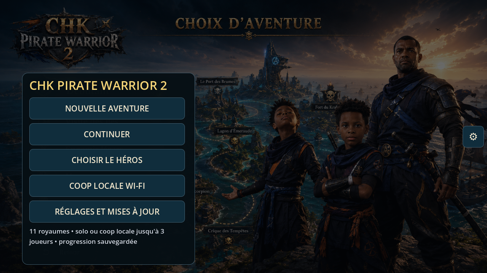
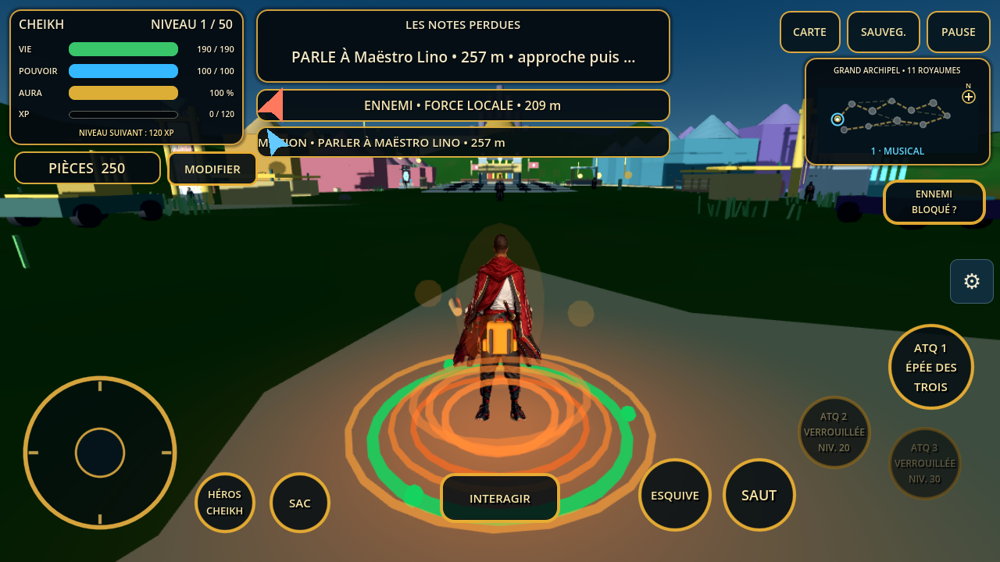
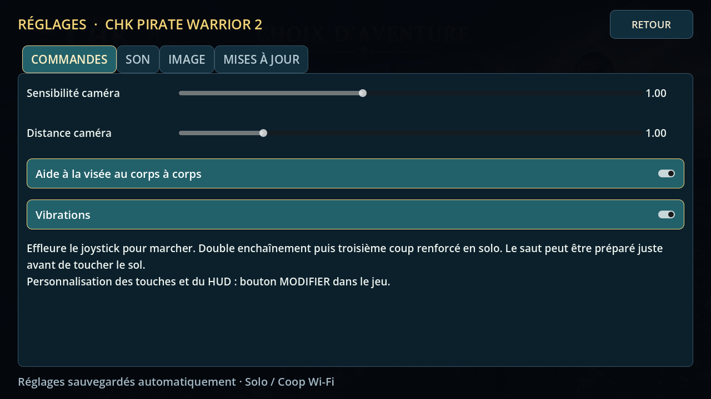
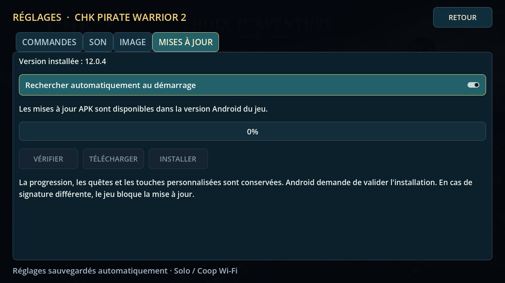
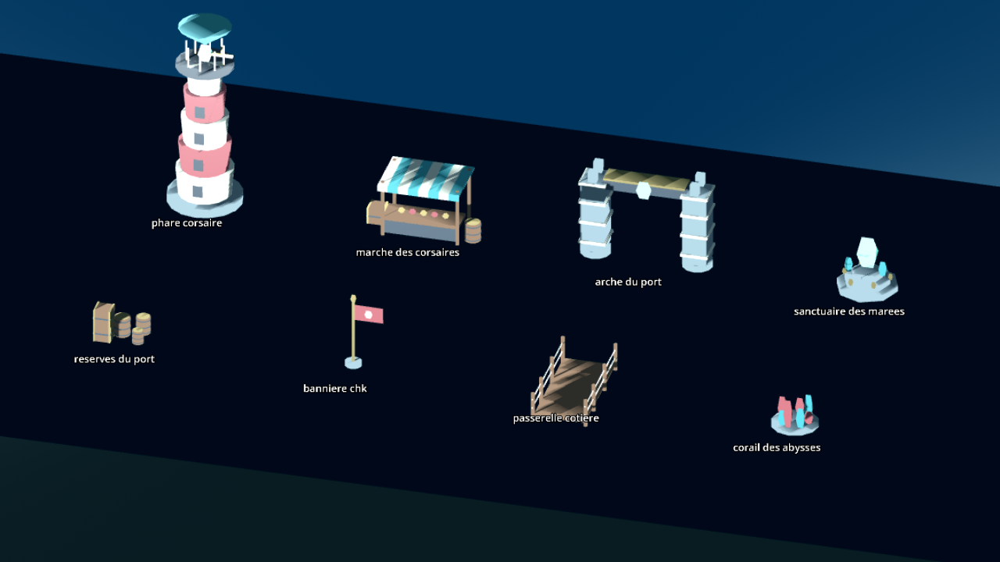

# Captures de la V12

Captures du jeu lancé avec Godot 4.7.1 et le rendu OpenGL à 1280 × 720,
issues de la [validation V12](https://github.com/Chasmet/Chk-pirate-warrior-2/actions/runs/34756950549).
L'accueil, les réglages et le HUD sont ceux du jeu. La galerie rassemble les huit
nouveaux GLB pour inspecter leur géométrie ; leurs instances sont également
intégrées aux onze royaumes.

## Accueil

## Vue du joueur

## Réglages

## Huit modèles originaux

